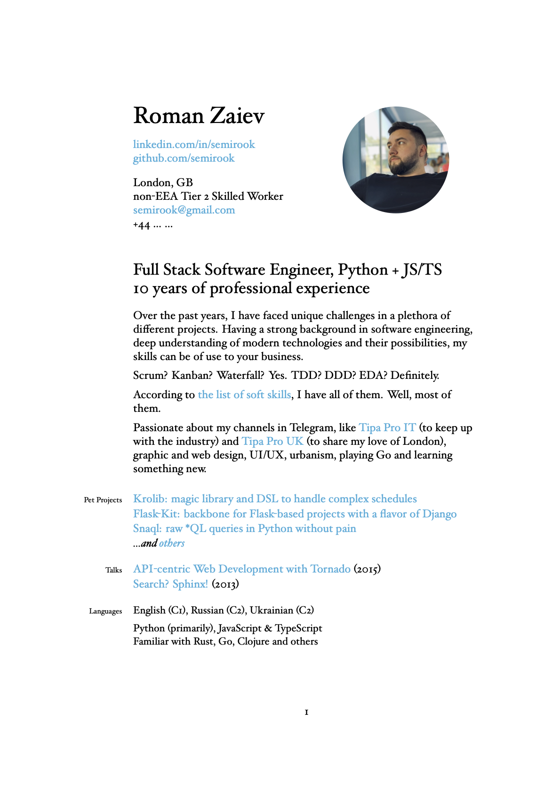

# IT CV

> Based on https://github.com/mrzool/cv-boilerplate

## Intro

The separation of content and presentation makes life easier.
And it's a perfect fit for a YAML file due to its structured nature:

```YAML
---
name: Your Name
photo: "me.jpg"
who:
  - Great Developer
natural_languages: >
  English (C1)
programming_languages: >
  Python, JavaScript
address:
  - City, Country
email: semirook@gmail.com
urls:
  - linkedin
  - github
intro: >
  Your cover letter
experience:
- years: Month 2017 — Month 2019
  employer: Company
  city: City, Country
  job: Software Engineer
  details: >
    Your unique experience
  stack:
    - list of buzzwords
```

That makes super easy to update your CV while keeping a consistent structure.

Thanks to [pandoc](http://pandoc.org/), we can access our data from `template.tex` using a special notation. Iterating on repetitive data structures becomes trivial:

```latex
$for(experience)$
  $experience.years$\\
  \textsc{$experience.employer$}\\
  \emph{$experience.job$}\\
  $experience.city$\\[.2cm]
$endfor$
```

LaTeX takes care of the typesetting with its usual elegance. Below is the preview of the final result.
Check out the [output](output.pdf) to see the compiled PDF.




With this method you can keep your entire CV described with a single YAML file, put it under version control (into a gist, for instance), and generate PDF on the fly when needed. You can also easily export it to other formats, like HTML for web publishing (I've heard [Jekyll](http://jekyllrb.com/) likes YAML). Convenient, portable and time-proof.

## Peculiarities

The original `cv-boilerplate` TeX template was updated with several specific blocks like `details` and `stack`. You don't have to use them all. Just pay attention that the first page is a cover letter only. Next pages are about your experience.
Your photo is rounded automatically but maybe you'll need to tune the `roundpic` macro values to center and size your face properly.

## Dependencies

1. LaTeX with the following extra packages: `fontspec` `geometry` `multicol` `xunicode` `xltxtra` `marginnote` `sectsty` `ulem` `hyperref` `polyglossia`
2. [Pandoc](http://pandoc.org/), the universal document converter.

To install LaTeX on Mac OS X, I recommend getting the smaller version BasicTeX from [here](https://tug.org/mactex/morepackages.html) and installing the additional packages with `tlmgr` afterwards. Same goes for Linux: install `texlive-base` with your package manager and add the needed additional packages later.

To install pandoc on Mac OS X, run `brew install pandoc`. To install it on Linux, refer to the [official docs](http://pandoc.org/installing.html).

## Getting started

1. Fill `details.yml` with your personal details, work experience, education, and desired settings.
2. Run `make` to compile the PDF.
3. Tweak on `template.tex` until you're satisfied with the result.

**Note**: this template needs to be compiled with XeTeX.

## License

This repository contains a modified version of Dario Taraborelli's [cvtex](https://github.com/dartar/cvtex) template.

License: [CC BY-SA 3.0](http://creativecommons.org/licenses/by-sa/3.0/)
